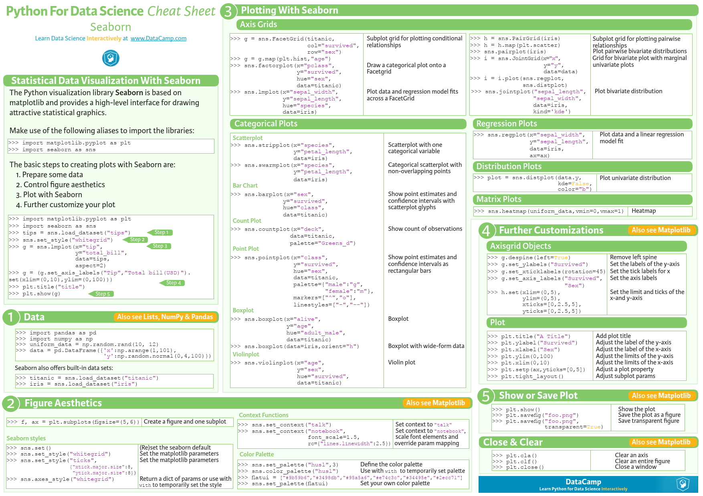

Basic consepts and operations from Seaborn libraries.00_all_in_one.ipynb includes all codes below the code list.

Contents:

-Scatter Charts
-Missing Value Detection
-Crossovers
-Histogram,Violin,Correleation Graph
-Heat Map

 
